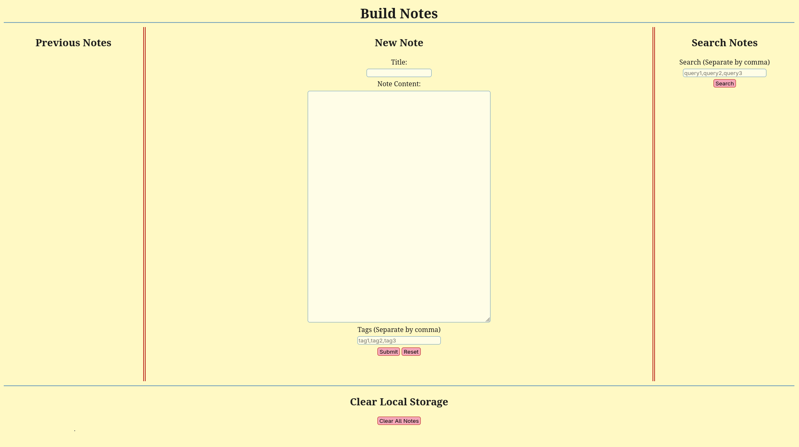
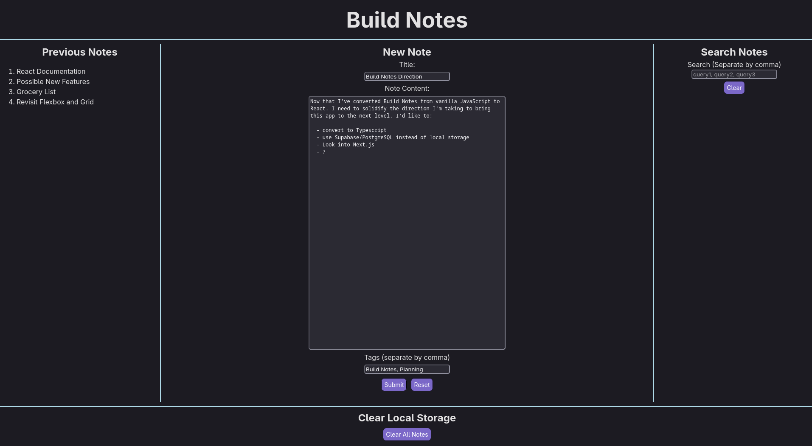
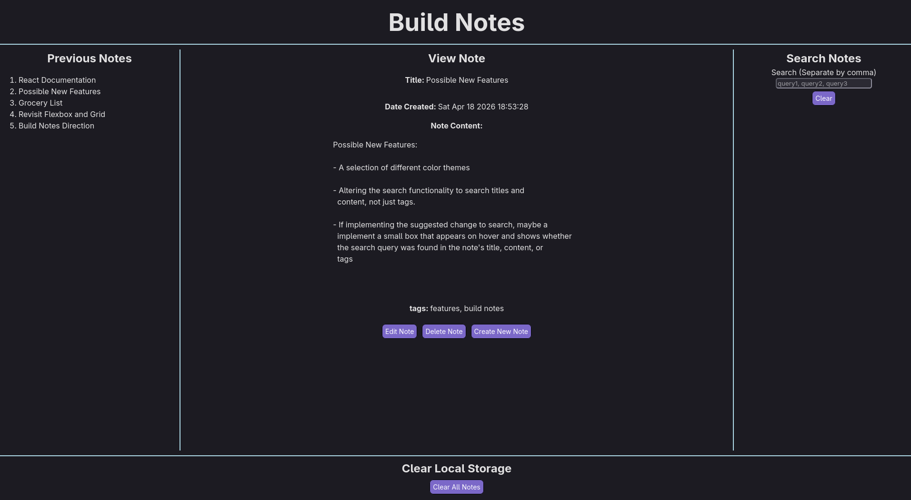
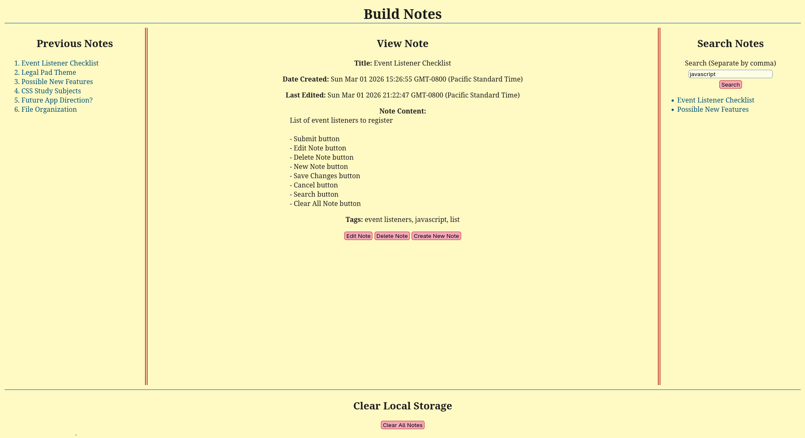
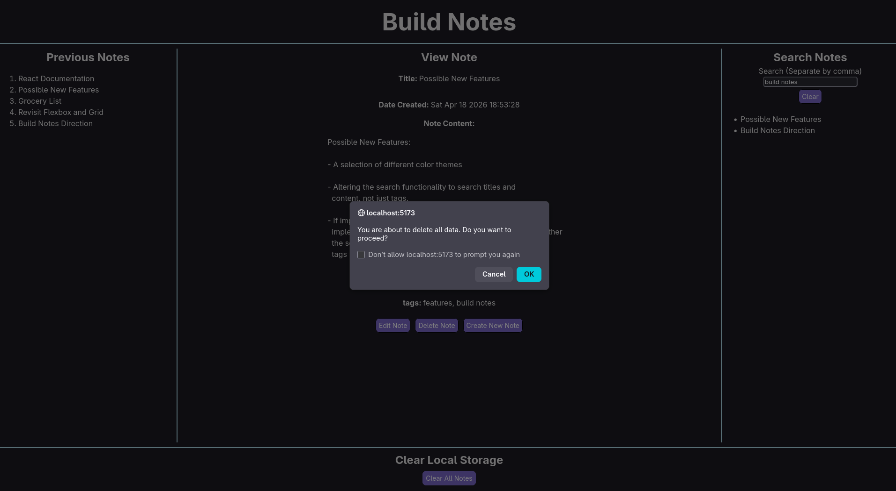

# Build Notes   
### A lightweight client-side note-taking app that runs directly in the browser.
   

## About
Build Notes was built as a learning project to develop foundational skills in HTML, CSS, and JavaScript, and has since been migrated to React. It is intended to serve as a starting point for a more fully featured application, with plans to eventually migrate to TypeScript, Supabase, and Next.js.

## Features
- Create note
- Edit note
- Delete note
- Live search notes by tag
- Persistent data via localStorage 

## Technologies Used
- HTML, CSS, JavaScript, React

## Getting Started

### Prerequisites
- [Node.js](https://nodejs.org/en/download)

### Installation
Clone the repository or download the zip folder and extract it.

### Running Build Notes
Ensure that Node.js has been installed. Navigate to the Build Notes directory. Once inside the directory open a terminal and run:

 `npm install`   
 
 `npm run dev` 
 
 Open the local URL shown in the terminal (e.g. `http://localhost:5173`)

## Usage
Build Notes operates in three modes: Create, Edit, and View.

### Create Mode
When opening Build Notes this is the default mode. In create mode you can enter a note title, content, and tags to search for the note. When finished, the 'Submit' button will save the note to local storage and the note's title will be shown in the 'Previous Notes' section to the left. Clicking the 'Reset' button while composing a note will clear it.

### View Mode
After creating a note its title will appear in the 'Previous Notes' section on the left. All note titles that appear here are clickable. To enter View Mode click on a note's title. In View Mode the note's title, the date it was created, the date it was last edited (if applicable), its content, and its tags, if any were included, are displayed. From here you have the option to edit the note, delete the note, or create a new note.

### Edit Mode
While viewing a note in View Mode clicking the 'Edit Note' button will switch to Edit Mode. Edit Mode looks similar to Create Mode, but has all the text fields populated with the note's data. Here you can make edits to any of the fields. Once the changes are saved the 'Last Edited' field in View Mode will display the time of the last edit. If the edits are canceled you are simply taken back to View Mode.

### Searching For Notes By Tags
On the right side of the page is the 'Search Notes' section. Here you can search for notes by tag. Multiple tags should be separated by a comma. When the 'Search' button is clicked the title of all the notes containing the relevant tags will be displayed. These are clickable and, if clicked will take you to View Mode.

### Clearing Local Storage
At the bottom of the page is the 'Clear All Notes' button. If this button is pressed a confirmation window will appear. To delete all notes click 'OK' in this window. All previous notes and search results will disappear.

## License
GNU General Public License v3.0

